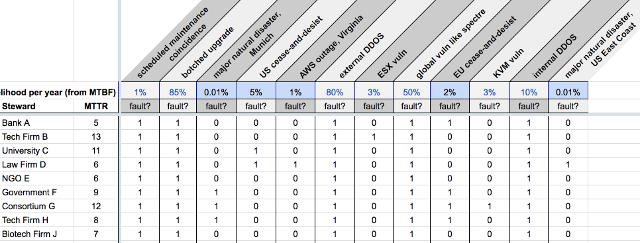

# 5001: Node Selection Algorithm
- Author: Sam Smith, Daniel Hardman
- Start Date: 2018-05-15
- Approval Date: 2018-06-15

## Summary

Describes an algorithm for deciding which nodes will participate in consensus, based
on which ones satisfy business constraints and are likely to add the least risk of network downtime. This algorithm
may be implemented with manual analysis at first; later, we imagine coding it into
software to make selection automated.

## Motivation

Sovrin needs a documented, objective method for deciding which stewards will run
validator nodes participating in consensus on the Sovrin Live Network (SLN), which
stewards will run validator nodes on the Sovrin Test Network (STN), and which will
run observer nodes or be "on deck" awaiting deployment.

## Tutorial

### Key Concepts

In the context of this SIP, a __problem__ is any adverse condition that might
challenge the health of a node. For example, a brownout of a node's network
connection might be a _problem_.

A __fault__ is a problem that leads to an individual node not adding value to
the consensus process. For example, if a node loses power, it is no longer able
to talk to its peers and vote in the byzantine consensus algorithm, and is thus
in a faulted state. Similarly, a node that has been hacked and is exhibiting
malicious behavior is _faulted_.

A __failure__ is an event where the network as a whole--NOT just a single node--
is unable to achieve consensus.

Sovrin's byzantine guarantee is that it can tolerate up to __f__ faults before
it fails, where the total number of nodes on the network, __n__, __= 3f + 1__.
The major goal of the algorithm described here is to keep significant downtime
as low as possible, by ensuring that the number of faulted nodes stays as
far away from __f__ as possible. It first does this by maximizing the distance
(in faulted nodes) between the deployed network and a potential failure--that
is, if we can find a combination of stewards where 10 would have to fail
before the network is down, this is better than a combination where only
3 would have to fail. Thus, a __failure distance__ of 10 is better than
one where the failure distance is 3--and so on.

If no combination of nodes can be found that prevents all downtime, then
the best combination of nodes is the one where downtime is minimized because
its nodes recover faster.

The amount of consideration we give to a period of downtime--its
__importance__--should consider two factors-- the __likelihood__ that it
will happen, and the __significance__ of it if it _does_ occur. Although
a meteor strike like the Chixculub impact that killed the dinosaurs has
high significance, its likelihood (once every 100M years or so) is low
enough that we don't include it in our disaster planning. Likewise, a
downtime that happens, on average, once every 24 hours might sound terrible--
but if it only lasts for 10 microseconds, its significance is so low as to be
unimportant. Thus, __Importance (I) = Likelihood (L) * Significance (S)__.

Drawing on the discipline of [_systems reliability_](
http://www.eventhelix.com/RealtimeMantra/FaultHandling/reliability_availability_basics.htm),
one measure of likelihood for a given scenario can be derived from
[__mean time between failures__ (__MTBF__)](
https://en.wikipedia.org/wiki/Mean_time_between_failures
) metrics. The more time elapses between failures, the less likely it is to occur,
so in cases where a simple linear probability curve obtains, an MTBF of
100 days could be converted into a 3.65% likelihood in a year.

Significance can also be quantified with a familiar _systems reliability_
concept, __mean time to repair__ (__MTTR__). This is a measure of downtime--
the more downtime, the more significant the failure.


### Failure Scenarios and Stewards

Failures must be analyzed on a case-by-case basis: _How well does this system
tolerate a natural disaster in Western Europe?_ _How well does it to tolerate
a legal cease-and-desist in the United States?_. Each scenario will have a
different likelihood and significance.

Each steward may react differently to each scenario. For example, a legal cease-and-desist
in the United States may have dramatic effect on stewards legally incorporated there,
moderate effect on stewards who only do business in the U.S., and no effect at
all on an NGO in China.

### Algorithm Overview

At the highest level, the algorithm works like this:

#### Prerequisities (Data)

1. Enumerate all steward candidates and the key characteristics of their nodes.
This produces data similar to what's shown below (though the specific columns
may differ as we learn which attributes are useful discriminators):


2. Define a set of failure scenarios. Include all scenarios that we consider
worthy of serious attention.

3. For each scenario, assign a likelihood (MTBF). This will probably involve
much guesswork, possibly informed by experience and observational data. For
example, we might come up with scenarios like these:


4. For each scenario, analyze how each steward candidate performs. Is the
steward's node vulnerable in this scenario, such that it will probably fault?
We can represent a fault with a 1 and a smooth continuation (no reaction
to the problem) with a 0, as in:



#### Input Parameters

We use the data above to build parameters and data structures as follows:

* __stewards__: A list of steward names.
* __mttrs__: A list of numbers that quantify how long stewards take to
  respond to disasters. Same size as stewards list, with corresponding
  indexes.
* __scenarios__: A list of scenario names.
* __likelihoods__: A list of numbers that derive from MTBF, and that
  quantify the relative likelihood of the different scenarios. Same size
  as scenarios list, with corresponding indexes.
* __faults__: A matrix of 1s and 0s, showing which stewards fault in
  which scenarios. A list of lists, where the inner lists capture one
  steward's fault profile across all scenarios, and the outer list is
  the same size as the stewards list.

Two additional input parameters are also supported:

* __f__: How many faulty nodes should the network tolerate before it
  fails? This number cannot exceed `int((num_stewards - 1) / 3)`. It
  becomes an optimization constraint for the algorithm.
* __bestN__: How big should the list of best combinations be? We may
  examine millions of possible steward combinations, but when we display
  results, we only need to display a small list of good options.

#### Computation

We now select the best combination of validator nodes, where
"best" is defined as the one that has the greatest cumulative failure
distance (if failures can be avoided altogether), or that has the least
overall amount of importance-weighted downtime, if failures are
unavoidable.

The pseudocode for the computation is:

```
make an empty "bestN" list to hold our top combinations

for each combination of stewards, C:
  for each scenario, S:
    compute a score for C@S, by:
      if C@S is a failure:
        find repair time, R, by:
          adding back fastest-to-recover nodestill only f nodes are faulted
        multiply R by likelihood for this scenario
        make the sign of the score negative since it's a bad outcome
      else:
        figure out about how long the uptime victory of this non-failure is, by:
           estimating how long downtime would last, on average, in failing combos
        multiply this number by likelihood for this scenario
        multiply by failure distance, since larger failure distance is better
        make the sign of the score positive since it's a good outcome
    add this scenario score to C's overall list of scenario scores
  add up all the scenario scores to get a combined score for C
  if C's score is good enough to be on the "bestN" list, put C in the list

report results by sorting and dumping the "bestN" list
```

The code for this is relatively simple, but it has a [combinatorics](
https://en.wikipedia.org/wiki/Combinatorics) challenge. If the total number of
validator node candidates is __N__ and the desired number of _consensus-participating_
stewards is __M__ (= 3 * __f__ + 1), then we have __N! / M!(N-M)!__ [combinations](
https://en.wikipedia.org/wiki/Combination) of steward nodes that we can deploy.
With __N__ = 25 and __M__ = 15, we have about 3.3M combinations, and if we
have to evaluate them against a dozen scenarios, we end up with about 39M
scenario+combination pairs to analyze.)

In practice, a simplified analysis that is not exhaustive may find good
answers--but not guarantee the optimal one--by focusing only on the most
important scenarios, as long as it doesn't perform averaging. Averages
hide outliers in a way that is unsafe; a node that has average good
performance in many scenarios may still be a terrible choice in a highly
important one.

Other factors may also be used to choose among alternatives that are equivalently
good from a pure failure perspective. For example, we might choose to value a
round-robin characteristic, where nodes share the opportunity to participate in
consensus--all else being equal, the node that's been participating in consensus
most recently is downvoted to give another node a chance. We might also choose
to vote against multiple nodes being run by the same organization, where "same"
could mean the same legal entity, or the same site of a multinational corp,
or the same IT staff. These might not be criteria based strictly on failure
modes, but might be important for logistical or political reasons. Such choices
are outside the strict scope of the current algorithm, but are at least
imagined to be compatible with it.

## Reference
[reference]: #reference

Live data on Sovrin stewards (Step 1) is maintained elsewhere. However, a
[sample spreadsheet](http://bit.ly/2GoYXTG) has been prepared, showing
how data might be entered and analyzed. Data from this spreadsheet has
been downloaded in CSV format and saved with this spec (see
[sample-data.csv](sample-data.csv)), providing a reference data format
and test data that can be used to exercise the algorithm.

In addition, a reference implementation has been written (see
[select.py](select.py)). It is attached to and versioned with this SIP,
and should function as an oracle for any alternative implementation.
Its output on the sample data looks like this:

```bash
 python select.py -f 1 --best 5 sample-data.csv
 Analyzing 126 total 4-steward combinations (n=9, f=1).

5 Best 4-Steward Combinations, Ranked
-------------------------------------
1: Bank A+Biotech Firm J+Law Firm D+NGO E: -40.3194
2: Bank A+Government F+Law Firm D+NGO E: -40.39
3: Bank A+Law Firm D+NGO E+Tech Firm H: -40.405
4: Bank A+Law Firm D+NGO E+Tech Firm B: -40.45425
5: Bank A+Law Firm D+NGO E+University C: -40.5093
```

The score at the end of each line is negative, reflecting the fact that
the sample data has a lot of downtime. This is partly because the sample
data has several common-mode failure scenarios. Negative numbers don't
equate with downtime, and positive numbers don't equate with failure
distance, but the bigger the number, the better the score. When the
algorithm runs against [sample-data-with-no-common-mode-failures.csv](
sample-data-with-no-common-mode-failures.csv), the output looks somewhat
better:

```bash
$ python select.py -f 1 --best 5 sample-data-with-no-common-mode-failures.csv
Analyzing 126 total 4-steward combinations (n=9, f=1).

5 Best 4-Steward Combinations, Ranked
-------------------------------------
1: Bank A+Biotech Firm J+Tech Firm B+Tech Firm H: 3.378325
2: Bank A+Biotech Firm J+NGO E+Tech Firm H: 2.52065
3: Bank A+Biotech Firm J+Law Firm D+Tech Firm H: 2.17
4: Bank A+Biotech Firm J+Law Firm D+NGO E: -0.4594
5: Bank A+Law Firm D+NGO E+Tech Firm H: -0.47
```


## Drawbacks
[drawbacks]: #drawbacks

This algorithm requires quite a bit of computation. For example, the
reference implementation took about 6 minutes to analyze 2.2 million
steward combinations for n=27, f=6, on a nice 2017-vintage laptop
(i7, 16 GB of RAM). There are undoubtedly optimizations possible, but
even with these optimizations, an exhaustive algorithm may be too
expensive to run continuously. Perhaps a reputation-based score could
be imputed to a steward's node, based on monte-carlo simulations and/or
historical performance?

The algorithm is only as good as its input data--and much of the input
data is guesswork. Guesses may get more accurate over time, but there
is no guarantee that they will get accurate _enough_.

## Rationale and alternatives
[alternatives]: #alternatives

Instead of trying to pick the optimal configuration of stewards in the
abstract, across all time, we could spend more time monitoring the
network and taking corrective action early. Enhanced monitoring is
probably a good idea regardless of the selection algorithm we use,
though the relative benefit of investing in it versus an optimizing
algorithm is unknown.

## Prior art
[prior-art]: #prior-art

The field of systems reliability provides many examples of similar
algorithms. This SIP captures mainstream thinking there.

## Unresolved questions
[unresolved]: #unresolved-questions

- How can/should the algorithm be optimized?
- When and how will the algorithm be run?
- How will results of the algorithm be used to adjust network configuration?
