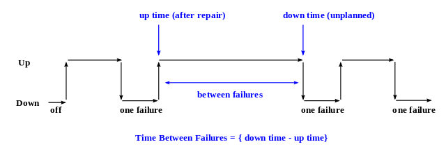

- Name: steward-selection-algorithm
- Author: Sam Smith, Daniel Hardman
- Start Date: 2018-05-15
- RFC PR: (leave this empty)
- Jira Issue: (leave this empty)

# Summary
[summary]: #summary

Describes an algorithm for deciding which nodes will participate in consensus, based
on which ones are likely to add the least risk of network downtime. This algorithm
may be implemented with manual analysis at first; later, we imagine coding it into
software to make selection automated.

# Motivation
[motivation]: #motivation

Sovrin needs a documented, objective method for deciding which stewards will run
validator nodes participating in consensus on the Sovrin Live Network (SLN), which
stewards will run validator nodes on the Sovrin Test Network (STN), and which will
run observer nodes or be "on deck" awaiting deployment.

# Tutorial
[tutorial]: #tutorial

### Key Concepts

In the context of this RFC, a __problem__ is any adverse condition that might
challenge the health of a node. For example, a network brownout might be a
_problem_.

A __fault__ is an event that leads to an individual node not adding value to
the consensus process. For example, if a node loses power, it is no longer able
to talk to its peers and vote in the byzantine consensus algorithm, and is thus
in a faulted state. Similarly, a node that has been hacked and is exhibiting
malicious behavior is _faulted_.

A __failure__ is an event where the network as a whole--NOT just a single node--
is unable to achieve consensus.

Sovrin's byzantine guarantee is that it can tolerate up to __f__ faults before
it fails, where the total number of nodes on the network, __n__, __= 3f + 1__.
The major goal of the algorithm described here is to keep __f__ as low as
possible, maximizing the distance (in faulted nodes) between the deployed
network and a potential failure. It is assumed that a deployment where the
__failure distance__ is 3 (3 more nodes would have to fault before the network
experiences failure) is better than one where the failure distance is 2--and so on.

Not all network failures merit are equally worrisome. The amount of consideration
we give to one--its __importance__--should consider two factors--
the __likelihood__ that it will happen, and the __significance__ of it
if it _does_ occur. Although a meteor strike like the Chixculub impact that
killed the dinosaurs has high significance, its likelihood (once every 100M years
or so) is low enough that we don't include it in our disaster planning. Likewise,
a downtime that happens, on average, once every 24 hours might sound terrible--
but if it only lasts for 10 microseconds, its significance is so low as to be
unimportant. Thus, __Importance (I) = Likelihood (L) * Significance (S)__.

Drawing on the discipline of [_systems reliability_](
http://www.eventhelix.com/RealtimeMantra/FaultHandling/reliability_availability_basics.htm),
one measure of likelihood for a given scenario can be derived from
[__mean time between failures__ (__MTBF__)](
https://en.wikipedia.org/wiki/Mean_time_between_failures
) metrics. The more time elapses between failures, the less likely it is to occur,
so in a simple linear probability curve, an MTBF of 100 days could be converted
into a 3.65% likelihood in a year.

Significance can also be quantified with a familiar _systems reliability_
concept, __mean time to repair__ (__MTTR__). This is a measure of downtime--
the more downtime, the more significant the failure.

### Failure Scenarios and Stewards

Failures must be analyzed on a case-by-case basis: _How well does this system
tolerate a natural disaster in Western Europe?_ _How well does it to tolerate
a legal cease-and-desist in the United States?_. Each scenario will have a
different likelihood and significance.

Each steward may react different to each scenario. For example, a legal cease-and-desist
in the United States may have dramatic effect on stewards legally incorporated there,
moderate effect on stewards who only do business in the U.S., and no effect at
all on a university in China.

### Algorithm Overview

At the highest level, the algorithm works like this:

1. Enumerate all steward candidates and the key characteristics of their nodes.
2. Define a set of failure scenarios. Include all scenarios that we consider
worthy of serious attention.
3. For each scenario, assign a likelihood (MTBF). This is likely to involve
much guesswork, possibly informed by experience and observational data.
4. For each scenario, analyze how each steward candidate performs. Is the
steward's node vulnerable in this scenario, such that it will probably fault?
If so, how long will it take to recover?
5. Based on 1-4, select the best combination of validator nodes, where
"best" is defined as the one that has the least amount of downtime (if
failure in some cases is unavoidable), or as the one that gives the most
amount of importance-weighted failure distance, if we can avoid it altogether.

How we accomplish Step 5 is worthy of discussion. We have a [combinatorics](
https://en.wikipedia.org/wiki/Combinatorics) problem. If the total number of
validator node candidates is __N__ and the desired number of _consensus-participating_
stewards is __M__, then we have __N! / M!(N-M)!__ [combinations](
https://en.wikipedia.org/wiki/Combination) of steward nodes that we can deploy.
Ideally, we would analyze the failure status or failure distance for every
possible combination of validator nodes, in every possible scenario, and
we would weight failures by their importance. If this algorithm is automated,
it may be possible to pick an optimal combination by brute force computation
(with __N__ = 25 and __M__ = 15, we have about 3.3M combinations, and if we
have to evaluate them against a dozen scenarios, we end up with about 39M
scenario+combination pairs to analyze.)

In practice, a manual analysis that is not exhaustive may be able to approximate
the ideal answer by focusing only on the most important scenarios, as long as
it doesn't perform averaging. Averages hide outliers in a way that is unsafe;
a node that has average good performance in many scenarios may still be a terrible
choice in a highly important one.

# Reference
[reference]: #reference

Live data on Sovrin stewards (Step 1) is maintained elsewhere. However, a
sample spreadsheet has been prepared, showing how data might be entered
and analyzed.

and is not publicized
in a spreadsheet and will not be
included here, since it changes regularly. 
interface definitions, formal function prototypes, error codes,
diagrams, and other technical details that might be looked up.
Strive to guarantee that:

- Interactions with other features are clear.
- Implementation trajectory is well defined.
- Corner cases are dissected by example.

# Drawbacks
[drawbacks]: #drawbacks

Why should we *not* do this?

# Rationale and alternatives
[alternatives]: #alternatives

- Why is this design the best in the space of possible designs?
- What other designs have been considered and what is the rationale for not choosing them?
- What is the impact of not doing this?

# Prior art
[prior-art]: #prior-art

Discuss prior art, both the good and the bad, in relation to this proposal.
A few examples of what this can include are:

- Does this feature exist in other SSI ecosystems and what experience have their community had?
- For other teams: What lessons can we learn from other attempts?
- Papers: Are there any published papers or great posts that discuss this? If you have some relevant papers to refer to, this can serve as a more detailed theoretical background.

This section is intended to encourage you as an author to think about the lessons from other 
implementers, provide readers of your RFC with a fuller picture.
If there is no prior art, that is fine - your ideas are interesting to us whether they are brand new or if it is an adaptation from other languages.

Note that while precedent set by other ecosystems is some motivation, it does not on its own motivate an RFC.
Please also take into consideration that Indy sometimes intentionally diverges from common identity features.

# Unresolved questions
[unresolved]: #unresolved-questions

- What parts of the design do you expect to resolve through the RFC process before this gets merged?
- What parts of the design do you expect to resolve through the implementation of this feature before stabilization?
- What related issues do you consider out of scope for this RFC that could be addressed in the future independently of the solution that comes out of this RFC?
